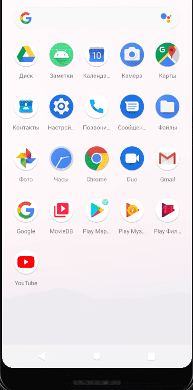
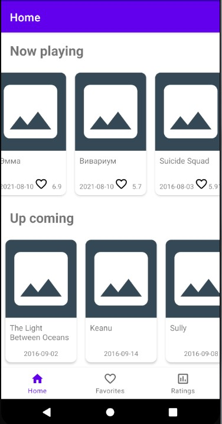

# Домашнее задание 2.
1. Необходимо выстроить архитектуру MVVM для будущего приложения, создать заглушки для экранов и переходы между ними.
2. \* Воспользуйтесь ViewBinding в своём проекте.
3. \* Добавьте в приложение рандомизатор, который будет возвращать разный результат загрузки данных: успех или ошибку. Обработайте ошибки загрузки.

\* Дополнительное задание

# Получившийся результат.

Что было сделано:
1. Создан новый проект с Bottom navigation.
2. Добавлены новые инконки, внесены изменения в Bottom navigation menu, переименованы фрагменты viewmodel-и.
3. Изменена иконка запуска приложения.
4. Для DI в проект добавлен Koin. Создан MyApplication класс для настройки Koin. ViewModel-и переделал на inject через Koin.
5. Добавлен sealed class AppState.
6. Созданы MoviesRepository и DataSource для дальнейшего использования. Теперь HomeViewModel в конструкторе получает MoviesRepository.
7. Созданы 2 адаптера NowPlayingMoviesAdapter и UpcomingMoviesAdapter для вывода через recyclerview на главный экран. 
8. Сделан UI для HomeFragment. Теперь на нем выводится список фильмов.  

