# Домашнее задание 2.
1. Необходимо выстроить архитектуру MVVM для будущего приложения, создать заглушки для экранов и переходы между ними.
2. \* Воспользуйтесь ViewBinding в своём проекте.
3. \* Добавьте в приложение рандомизатор, который будет возвращать разный результат загрузки данных: успех или ошибку. Обработайте ошибки загрузки.

\* Дополнительное задание

# Получившийся результат.

Что было сделано:
1. Создан новый проект с Bottom navigation.
2. Добавлены новые инконки, внесены изменения в Bottom navigation menu, переименованы фрагменты viewmodel-и.
3. Изменена иконка запуска приложения.
4. Для DI в проект добавлен Koin. Создан MyApplication класс для настройки Koin. ViewModel-и переделал на inject через Koin.
5. Добавлен sealed class AppState.
6. Созданы MoviesRepository и DataSource для дальнейшего использования. Теперь HomeViewModel в конструкторе получает MoviesRepository.
7. Созданы 2 адаптера NowPlayingMoviesAdapter и UpcomingMoviesAdapter для вывода через recyclerview на главный экран. 
8. Сделан UI для HomeFragment. Теперь на нем выводится список фильмов.  


# Домашнее задание 3.
1. Добавьте экран с описанием конкретного фильма.
2. \* Добавьте несколько горизонтальных списков для разных категорий фильмов.

\* Дополнительное задание

# Получившийся результат.

Что было сделано:
1. Изменил реализацию главного экрана с категориями фильмов. Ранее была реализация с несколькими recylcer view, которые идут друг за другом. Заменил её на один общий вертикальный recylcer view по категориям с фильмами, в рамках которого уже будут recycler view горизонтальные со списком фильмов.
2. Реализовал экран с описанием фильма, там минимальная информация. Переход на экран описания фильма осуществляется из главного экрана со списками фильмов.

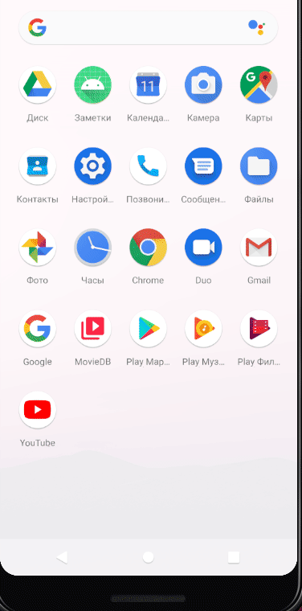

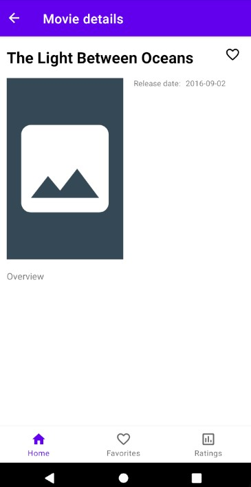

# Домашнее задание 4.
1. Проведите рефакторинг вашего приложения в соответствии с полученными знаниями о возможностях языка и хорошими практиками программирования на Kotlin.
2. Напишите дополнительные extension-функции для Snackbar без action, а также такие, что принимают строковые ресурсы (R.string...) в качестве текста. 

# Домашнее задание 5.
1. Получайте данные с сервера The Movie DataBase. Постеры фильмов мы научимся грузить на следующих уроках — можете оставить для них заглушки.
2. \* Вынесите бизнес-логику, то есть запрос на сервер и парсинг данных, в отдельный класс. Фрагменты должны запрашивать только данные о фильмах и получать их из класса, занимающегося загрузкой.
3. \* Обрабатывайте ошибки запроса и парсинга данных: отображайте экран с ошибкой, или диалоговое окно, или Snackbar.

\* Дополнительное задание

# Получившийся результат.

Что было сделано:
1. Создал новый файл в корне проекта apikey.properties. В этом файле у меня хранится ключ к The Movie DataBase. Добавил его в .gitignore.
2. Добавил 2 переменные в настройки сборки: MOVIEDB_BASE_URL и MOVIEDB_API_KEY, чтобы проще было в дальнейшем с ними работать.
3. Добавил в проект разрешение на доступ в интернет, а также зависимость GSON.
4. Добавил новый источник данных RemoteDataSourceImpl, в котором прописана логика взаимодействия с сайтом.
5. Так как мне нужно выносить на уровень UI ошибку, то решил поменять тип возвращаемых данных на kotlin Result. Обновил interface DataSource и interface MoviesRepository, а также все классы, которые эти интерфейсы реализуют.
6. Создал новый класс NowPlayingMoviesDTO для десериализации при помощи Gson.
7. Подправил HomeFragment, HomeViewModel и fragment_home.xml для вывода полученной информации с сервера, либо ошибки.

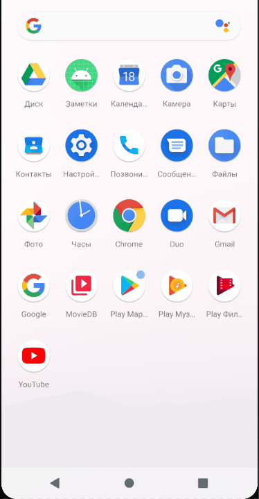
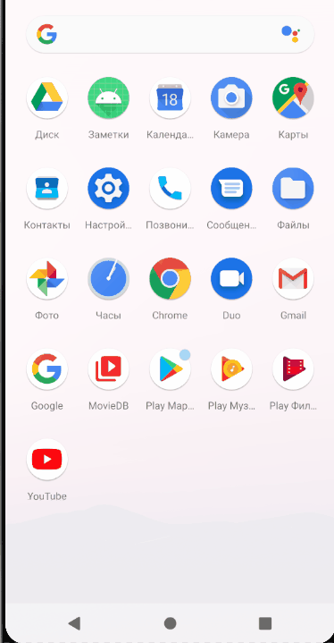

# Домашнее задание 6.
1. Подпишитесь на событие изменения связи (CONNECTIVITY_ACTION) и уведомляйте об этом пользователя.
2. Переведите хотя бы один экран своего приложения на использование связки «сервис + BroadcastReceiver» для получения данных из интернета.
3. \* Создайте два разных приложения и передавайте между ними данные или создайте привязанный сервис, как это описывается в факультативе.

\* Дополнительное задание

# Получившийся результат.

Что было сделано:
1. Создал ConnectivityActionBroadcastReceiver, который отслеживает события ConnectivityManager.CONNECTIVITY_ACTION. Зарегистрировал его программно в MainActivity.
2. Создал новый сервис MovieDownloadService для скачивания информации с сайта, далее через BroadcastReceiver эта информация отображается во фрагменте. Для взаимодействия с новым сервисом создал новый фрагмент HomeWithServiceFragment.
3. Создал 2 тестовых приложения: BroadcastSender - для отправки сообщений, MessageReceiver - для получения сообщений через BroadcastReceiver.

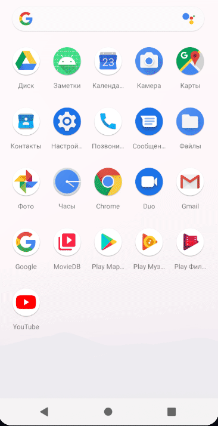
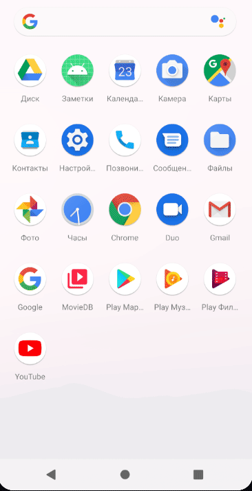


# Домашнее задание 7.
1. Используйте Retrofit для получения данных с сервера.
2. Используйте Glide или Picasso для загрузки изображений.
3. \* Используйте библиотеку Coil в качестве загрузчика изображений.

\* Дополнительное задание

# Получившийся результат.

Что было сделано:
1. Создал MovieDbService для описания сервиса для Retrofit.
2. Создал синглтон NetworkModule, в котором методы по получению OkHttpClient, Retrofit и MovieDbService.
3. Создал HeadersInterceptor для добавления header-ов, в том числе ключа авторизации.
4. Прописал в KoinModule создание OkHttpClient, Retrofit и MovieDbService.
5. Переименовал старый RemoteDataSourceImpl в RemoteDataSourceOldImpl - в нем логика получения данных через HttpsURLConnection.
6. Создал новый RemoteDataSourceImpl, в котором реализовал получение данных через MovieDbService.
7. Реализовал загрузку изображений через Coil.
8. После того, как поэкспериментировал с Coil, переделал загрузку изображений через Glide. В роли placeholder создал CircularProgressDrawable.

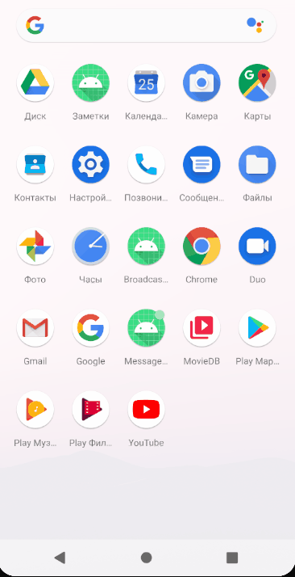


# Домашнее задание 8.
1. Поиск по фильмам возвращает в том числе и «взрослый контент». Это параметр adult в ответе сервера. Создайте экран с настройками или чекбокс в меню приложения и добавьте туда настройку «включение — выключение» взрослого контента. Зафиксируйте эту настройку в SharedPreferences.
2. Добавьте возможность оставлять заметку о просмотренном фильме, чтобы сохранять её в базе данных.
3. Создайте БД для вашего приложения и храните там историю запросов: сведения о фильмах, время просмотра, заметку о фильме.
4. Выполняйте запросы в БД асинхронно (в рабочем потоке).
5. \* Добавьте возможность сохранять фильмы в список понравившихся. Это будет отдельный экран, в котором можно будет загружать список понравившихся фильмов.

\* Дополнительное задание

# Получившийся результат.

Что было сделано:
1. Создал новый экран с настройками. Переход осуществляется из меню главного экрана. 
2. Сделал MainSharedPreferencesWrapper - это удобная обертка над SharedPreferences. Прокинул её во viewmodel-и через di.
3. На экране настроек реализовал сохранение/восстановление настройки 'Adult content'. Эта настройка используется на главном экране для сортировки списка фильмов после получения его с сервера.
4. Добавил зависимости room. Создал базу данных для приложения.
5. Добавил новые сущности БД, TypeConverter для даты, а также MovieGetDao и MovieSetDao.
6. Создан новый экран с историей просмотров. Переход осуществляется из меню главного экрана.
7. Переделал экран информации о фильме, раньше принимался parcelable объект, теперь принимается id фильма, а далее загрузка идёт из локальной БД.
8. Реализовал переход на экран информации о фильме с экрана истории просмотров.
9. Реализовал возможность сохранения заметки о фильме в базу.
10. Добавил возможность сохранять фильмы в избранное, как с главного экрана, так и с экрана информации о фильме.
11. Реализовал экран для просмотра фильмов в списке Избранное. Также в этом списке можно убирать из избранного, а также переходить на экран информации о фильме.

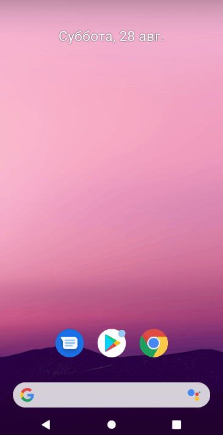


# Домашнее задание 9.
1. Добавьте экран со списком контактов в своё приложение.
2. \* Добавьте фильтры для главного экрана или истории просмотра, чтобы фильтровать содержимое списков.
3. \* Добавьте возможность позвонить по номеру из списка контактов.

\* Дополнительное задание

# Получившийся результат.

Что было сделано:
1. Реализовал поиск на экране истории просмотров.
2. Добавил новый экран со списком контактов для отправки сообщения о фильме.
3. Вызов экрана со списком контактов доступен с экрана информации о фильме.
4. При попытке вызова экрана со списком контактов осуществляется проверка на наличие Permission-а android.permission.READ_CONTACTS.
5. С этого же экрана можно вызвать телефон для звонка, если у контакта указан номер.

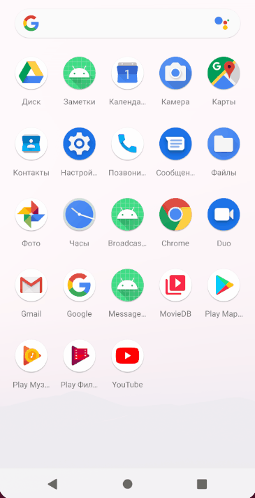
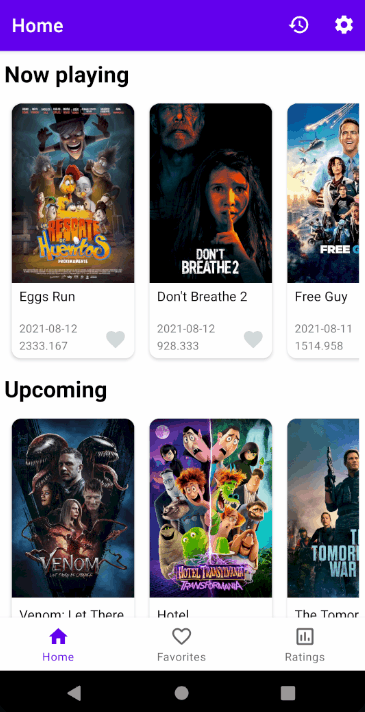
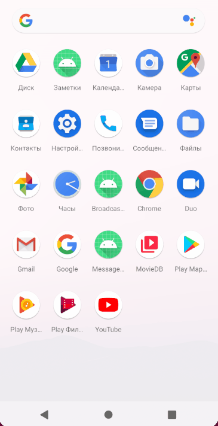

# Домашнее задание 10.
1. Добавьте в своё приложение экран с картой, поиском по адресу и отображением адреса по координатам.
2. В качестве альтернативы или дополнения: откройте карту с местом рождения актёра. Если вы запрашиваете данные об актёре, с сервера приходит параметр place_of_birth, из которого можно получить координаты.
3. \* Добавьте кинотеатры вашего города в геозоны и отображайте диалоговое окно при вхождении в неё.

\* Дополнительное задание

# Получившийся результат.

Что было сделано:
1. Переделал экран с информацией о фильме, теперь в шапке экрана будет выводиться баннер фильма, ниже будет информация о бюджете фильма и режиссере.
2. Добавлена миграция MigrationFrom1To2 для добавления новых колонок в таблицу Movie, а также создания 2 новых таблиц: Actor и MovieActorCrossRef.
3. Добавлены новые запросы в Retrofit для получения расширенной информации о фильме, а также об актере.
4. Расширил интерфейс DataSource новыми методами: getMovieDetails, getPerson. В RemoteDataSourceImpl эти методы реализованы с использованием MovieDbService.
5. Добавлены новые DTO сущности.
6. Добавлен вывод первых 10 актеров на экране информации о фильме.
7. Реализован новый экран с информацией об актере, в котором выводится дата рождения, место рождения и биографии.
8. Реализован новый экран с картой, на которую можно перейти с экрана информации об актере по нажатию на место рождения. При переходе на этот экран осуществляется проверка на наличие Permission-а android.permission.ACCESS_FINE_LOCATION. На экране реализован поиск и переход к текущему местоположению.
9. Создал новый класс GeofencesWrapper для работы с геозонами.
10. Реализовал работу с геозонами (Geofence) на экране с картой. Теперь по долгому нажатию рисуется геозона с добавлением её в geofence.
11. Создан GeofenceBroadcastReceiver для отслеживания событий, связанных с добавленными геозонами.
12. Добавлено разрешение android.permission.ACCESS_BACKGROUND_LOCATION, т.к. это разрешение требуется для работы с геозонами, начиная с SDK 29.
13. При появлении событий ENTER и EXIT у добавленных геозон, появляется toast и notification. 
14. Google api key хранится в apikey.properties. Ранее был добавлен в gitignore.

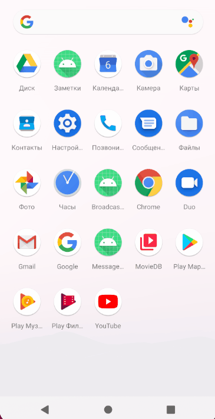
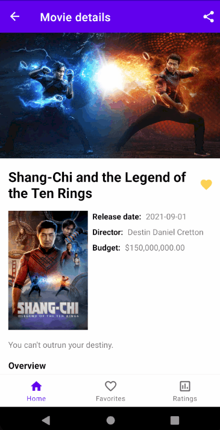


# Домашнее задание 11.
1. Добавьте в ваше приложение возможность получения push-уведомлений.
2. \* Изучите Channels и их свойства.

\* Дополнительное задание

# Получившийся результат.

Что было сделано:
1. Подключил Firebase Cloud Messaging в проект.
2. Немного изменил экран информации о фильме, добавил вывод ID фильма. В дальнейшем он понадобится.
3. Создал отдельный класс NotificationHelper для управления уведомлениями. 
4. В MyApplication создаю каналы через NotificationHelper(this).createChannels(). У меня 2 канала: один для geofence receiver, а второй - это новый канал для получения информации об избранных фильмах.
5. Все id, name и description каналов добавил в strings.xml.
6. Расширил MovieRepository методом getFavoriteMovieById - если фильм в избранных, то он вернется, иначе null.
7. Переделал GeofenceBroadcastReceiver на использование NotificationHelper.
8. Добавил в проект использование SafeArgs.
9. Переделал MovieDetailsFragment на использование SafeArgs.
10. Реализовал MyFirebaseMessagingService для обработки сообщений от Firebase Cloud Messaging. Реализовал обработку data-сообщений в onMessageReceived. 
11. Создал метод createDeepLink в companion object-е MovieDetailsFragment, чтобы можно было создавать PendingIntent до экрана с конкретным фильмом.
12. Переделал всё взаимодействие в проекте через SafeArgs.
13. По итогу реализована следующая логика - при получении data-сообщения от Firebase Cloud Messaging анализируется наличие параметра movieId, если этот параметр указан и id этого фильма находится в списке favorite, то я отправляю уведомление в стиле BigPictureStyle с датой релиза. По нажатию на это уведомление открывается экран с информацией о конкретном фильме.


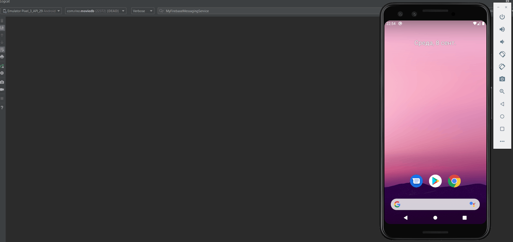
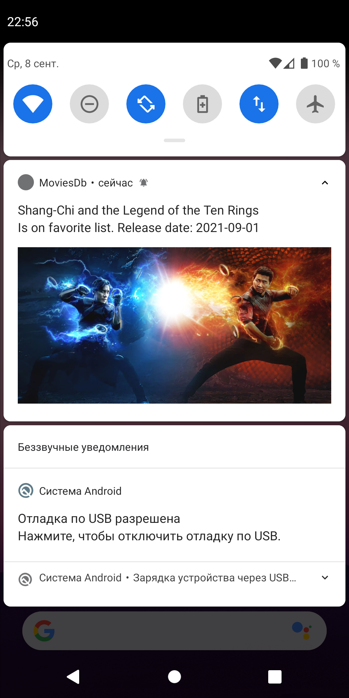

## **Небольшой мануал по использованию Firebase Cloud Messaging через POST-запросы.**

Я выяснил, что есть 2 типа сообщений, отправляемых через FCM: **data message и notification message**. Разница в том, что если мы посылаем notification message, то он попадает onMessageReceived только в случае, если приложение находится в foreground-е, другими словами, если приложение свернуто, то onMessageReceived не сработает. При это, если отправляется data message, то он попадает в onMessageReceived в любом случае. Ах да, в обоих случаях сообщения проходят через handleIntent.  
Теперь к конкретике. **Для отправки POST-запросов через FCM нужно использовать URL => https://fcm.googleapis.com/fcm/send . Header-ы следующие:**
1) Content-Type: *application/json*
2) Authorization: *key=<SERVER_KEY>* => его можно найти в Firebase -> Project Settings -> Cloud Messaging

### **Пример notification message:** 
```
{  
    "to": "ТОКЕН_УСТРОЙСТВА",  
    "collapse_key": "com.rino.moviedb",  
    "notification": {  
        "title": "Notification Title from Notification",  
        "priority": "high",  
        "body": "Sending Notification Body From Notification",  
        "icon": "icon_url",  
        "click_action": "action_url",  
        "movieId": "566525"  
    }  
}
```  

### **Пример data message:** 
```
{  
    "to": "ТОКЕН_УСТРОЙСТВА",  
    "collapse_key": "com.rino.moviedb",  
    "data": {  
        "priority" : "high",  
        "body": "Sending Notification Body From Data",  
        "title": "Notification Title from Data",  
        "movieId": "566525"  
    }  
}
```  

# Домашнее задание 12.
1. Вынесите в файл properties пароли для подписанного приложения.
2. Создайте ещё одну версию приложения.
3. Проверьте свой код на принципы KISS, DRY, YAGNI.

# Получившийся результат.

Что было сделано:
1. Ранее в процессе разработки уже был создан apikey.properties. В этом файле у меня хранится ключ к The Movie DataBase, а также Google api key.  Этот файл добавлен в .gitignore.
2. Сгенерировал keystore.jks для подписи релизной сборки. Прописал настройки в signingConfigs в build.gradle.
3. Создан файл keystore.properties для хранения паролей от keystore.jks. Далее они будут подтягиваться при сборке.
4. Добавил  keystore.jks и keystore.properties в .gitignore.
5. Поэкспериментировал с версиями приложений (flavors). Создал для этого измерение (dimension) - version.